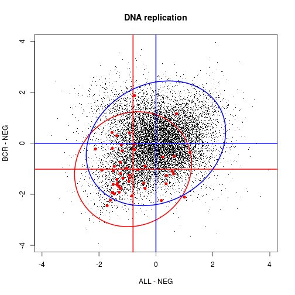
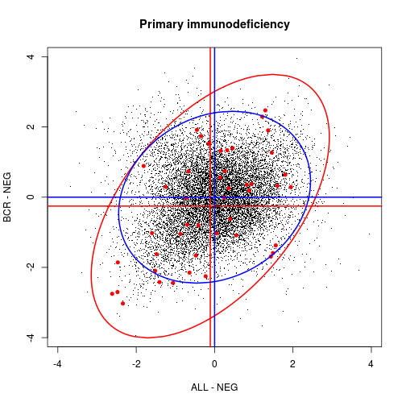
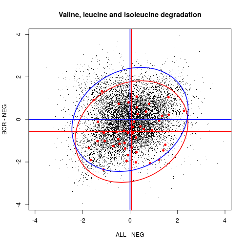
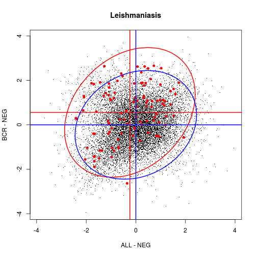
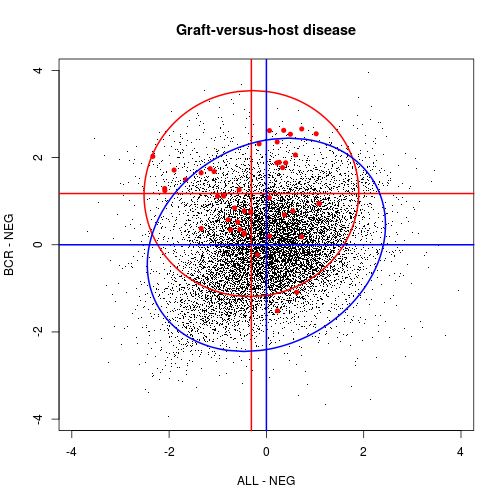

\vspace{5mm}\hrule

<!-- OPTIONS ------------------------------------------------------------------>


<!-- LINKS -------------------------------------------------------------------->

[montaner2010]:http://www.plosone.org/article/info%3Adoi%2F10.1371%2Fjournal.pone.0010348 "mdgsa Paper"

[paperALL]: http://bloodjournal.hematologylibrary.org/cgi/pmidlookup?view=long&pmid=14684422 "Reference of the ALL dataset"

[bioconductor]:http://bioconductor.org/ "Bioconductor home page"
[all]:http://bioconductor.org/packages/release/data/experiment/html/ALL.html "ALL Bioconductor data library"
[limma]:http://bioconductor.org/packages/release/bioc/html/limma.html "Bioconductor limma package"
[hgu95av2.db]:http://bioconductor.org/packages/release/data/annotation/html/hgu95av2.db.html "Bioconductor annotation package"

[kegg]:http://www.genome.jp/kegg/ "KEGG web site"
[go]:http://geneontology.org/ "Gene Ontology Consortium"


Introduction
================================================================================

The `mdgsa` library implements the _gene set analysis_ methodology developed in
[Montaner and Dopazo (2010)][montaner2010].
It presents a flexible framework for analyzing the enrichment of _gene sets_ along a given _ranking_ of genes.
The novelty is that,
not just one _ranking index_ but two,
may be analyzed and jointly explored 
in a __multidimensional gene set analysis__.

As classical _GSEA_,
our approach allows for the functional profiling of isolated genomic characteristics; 
differential gene expression,
copy number analyses,
or variant to disease associations
may be interpreted in terms of _gene sets_ using the `mdgsa` package.
But more interestingly,
our multivariate approach may be used to find out _gene set_ enrichments
due to the combined effect of two of such genomic dimensions.
We could for instance detect _gene sets_
affected by the interaction of
gene expression changes and copy number alterations. 


Citation
----------------------------------------

Further description of the `mdgsa` methods may be found at:

> _Multidimensional gene set analysis of genomic data._  
> David Montaner and Joaquin Dopazo.  
> [PLoS One. 2010 Apr 27;5(4):e10348. doi: 10.1371/journal.pone.0010348.][montaner2010]


\newpage 


Functional Profiling of Gene Expression Data
================================================================================

In this tutorial we use the data in the 
[Acute Lymphocytic Leukemia expression dataset][all] package of [Bioconductor]. 
First we will use the [limma] library to compute a differential gene expression analysis.
Then we will use the functions `uvGsa` and `mdGsa` in the `mdgsa` package
to perform uni-dimensional and bi-dimensional gene set analyses respectively.
The functional interpretation will be done in terms of [KEGG] Pathways.
The annotation will be taken from the [hgu95av2.db] library in [Bioconductor].


First we load the data and describe the design matrix of the experiment


```r
library (ALL)
data (ALL)

des.mat <- model.matrix (~ 0 + mol.biol, data = ALL)
colnames (des.mat) <- c("ALL", "BCR", "E2A", "NEG", "NUP", "p15")
head (des.mat)
```

```
##       ALL BCR E2A NEG NUP p15
## 01005   0   1   0   0   0   0
## 01010   0   0   0   1   0   0
## 03002   0   1   0   0   0   0
## 04006   1   0   0   0   0   0
## 04007   0   0   0   1   0   0
## 04008   0   0   0   1   0   0
```

Then we can use `limma` to carry out
some gene expression comparisons.
We can for instance compare 
_ALL_ samples to _NEG_ control samples or 
explore gene differential expression between 
_BCR_ and _NEG_. 


```r
library (limma)
cont.mat <- makeContrasts (ALL-NEG, BCR-NEG, levels = des.mat)
cont.mat
```

```
##       Contrasts
## Levels ALL - NEG BCR - NEG
##    ALL         1         0
##    BCR         0         1
##    E2A         0         0
##    NEG        -1        -1
##    NUP         0         0
##    p15         0         0
```

```r
fit <- lmFit (ALL, design = des.mat)
fit <- contrasts.fit (fit, cont.mat)
fit <- eBayes (fit)
```

From this analysis we get _test statistics_ and _p-values_ for each of the two contrasts


```r
fit$t[1:3,]
```

```
##            Contrasts
##              ALL - NEG  BCR - NEG
##   1000_at   -2.2610931 -0.7684296
##   1001_at   -1.0962463  0.2064388
##   1002_f_at  0.7978798 -1.7527367
```

```r
fit$p.value[1:3,]
```

```
##            Contrasts
##              ALL - NEG  BCR - NEG
##   1000_at   0.02548234 0.44368153
##   1001_at   0.27507879 0.83678412
##   1002_f_at 0.42645360 0.08209929
```

These gene level information may be now interpreted in terms of _gene sets_.
For this example we will carry out a _gene set analysis_ using the functional blocks described in [KEGG],
but any other functional data base such as the [Gene Ontology][go] or even a customized one may be analyzed using `mdgsa`.
We can get the [KEGG] annotation from the [hgu95av2.db] library as follows.


```r
library (hgu95av2.db)
anmat <- toTable (hgu95av2PATH)
anmat[1:3,]
```

```
##   probe_id path_id
## 1  1000_at   04010
## 2  1000_at   04012
## 3  1000_at   04062
```


Univariate Gene Set Analysis
--------------------------------------------------------------------------------

We can now carry out the functional interpretation
of the contrast "BCR - NEG" for instance.

The data needed for the gene set analysis
are the p-values and test statistics returned by `limma` at gene level.


```r
fit$t[1:3, "BCR - NEG"]
```

```
##    1000_at    1001_at  1002_f_at 
## -0.7684296  0.2064388 -1.7527367
```

```r
fit$p.value[1:3, "BCR - NEG"]
```

```
##    1000_at    1001_at  1002_f_at 
## 0.44368153 0.83678412 0.08209929
```

We load the `mdgsa` library.


```r
library (mdgsa)
```

The first step in the procedure is to combine p-values and test statistics in a single ranking value. 


```r
rindex <- pval2index (pval = fit$p.value[,"BCR - NEG"], sign = fit$t[,"BCR - NEG"])
rindex <- indexTransform (rindex)
rindex[1:3]
```

```
##    1000_at    1001_at  1002_f_at 
## -0.4038315  0.4309088 -1.2145063
```

This _ranking index_ keeps the sign of the test statistic;
that is, the information of whether the gene is over or underexpressed.


```r
plot (fit$t[,"BCR - NEG"], rindex)
```

 

but the evidence of the differential expression is taken directly from the p-value


```r
plot (fit$p.value[,"BCR - NEG"], rindex)
```

 

Next we will need to format the annotation.
The function `annotMat2list` in the `mdgsa` library
converts the annotation matrix into a list.


```r
anmat[1:3,]
```

```
##   probe_id path_id
## 1  1000_at   04010
## 2  1000_at   04012
## 3  1000_at   04062
```

```r
annot <- annotMat2list (anmat)
length (annot)
```

```
## [1] 228
```

Each element of the list contains the gene names of a gene set.


```r
lapply (annot[1:3], head, n= 3)
```

```
## $`00010`
## [1] "2035_s_at"  "31488_s_at" "32210_at"  
## 
## $`00020`
## [1] "160044_g_at" "32332_at"    "32546_at"   
## 
## $`00030`
## [1] "31485_at" "32210_at" "32336_at"
```

It is also important to make sure that the
_gene universe_ described by the _ranking index_
and the _annotation_ are concordant.
The function `annotFilter`
encompasses the annotation list to the names in the ranking index;
it is also used to exclude functional blocks too small to be considered gene sets,
or too big to be specific of any biological process of interest.


```r
annot <- annotFilter (annot, rindex)
```

```
## 
## 42.57% of the genes in the index are annotated in the list.
## 
## Filtering annotation by size:
##    18 small blocks removed.
##    2 big blocks removed.
##    208 blocks remain in the annotation.
```

Now everything is ready to carry out the _univariate_ gene set analysis.


```r
res.uv <- uvGsa (rindex, annot)
```

```
## Analyzed blocks:
## 100, 200, 
## time in seconds:
##    user  system elapsed 
##  11.313   0.000  11.306
```

The output of the `uvGsa` function is a data frame
which rows correspond to functional blocks analyzed.


```r
res.uv[1:3,]
```

```
##        N         lor       pval      padj
## 00010 65 -0.08900436 0.47430323 1.0000000
## 00020 33 -0.26525586 0.12586858 1.0000000
## 00030 20 -0.53224486 0.01979982 0.3164805
```

The `uvGsa` function fits a _logistic regression model_
relating, the probability of genes belonging to the gene set,
with the value of the ranking statistic.

Significant and __positive__ _log odds ratio_ (`lor`) indicate that the gene set is enriched in those genes with __high values__ of the ranking statistic.
In our example this means that genes up regulated in _BCR_ compared to _NEG_ are more likely to belong to the functional block.
We could also say that the block of genes shows a significant degree of over expression _BCR_ compared to _NEG_.

On the other hand, when a gene set has a __negative__  _log odds ratio_ we can say that the genes in the set are more likely to be associated to __low values__,
negative in our case, of the ranking statistics.
In our case this means that the gene set is down regulated in _BCR_ compared to _NEG_.

The function `uvPat` helps you classifying the analyzed gene sets


```r
res.uv[,"pat"] <- uvPat (res.uv, cutoff = 0.05)
table (res.uv[,"pat"])
```

```
## 
##  -1   0   1 
##  11 155  42
```

Positive values (1)  correspond to significant and positive _log odds ratios_.
Negative values (-1) correspond to significant and negative _log odds ratios_.
Zeros correspond to non enriched blocks.

As in this example we are analyzing [KEGG] pathways we can use the function `getKEGGnames`
to find out the "name" of the pathways^[Similar function `getGOnames` is available to be used with [Gene Ontology][go] terms.].


```r
res.uv[,"KEGG"] <- getKEGGnames (res.uv)
```

Finally, the function `uvSignif` may help us displaying just the enriched blocks.


```r
res <- uvSignif (res.uv)
res[,c("pat", "KEGG")]
```

```
##       pat                                                       KEGG
## 05332   1                                  Graft-versus-host disease
## 05416   1                                          Viral myocarditis
## 05330   1                                        Allograft rejection
## 04612   1                        Antigen processing and presentation
## 05131   1                                                Shigellosis
## 04142   1                                                   Lysosome
## 04145   1                                                  Phagosome
## 04940   1                                   Type I diabetes mellitus
## 04670   1                       Leukocyte transendothelial migration
## 05100   1                     Bacterial invasion of epithelial cells
## 05323   1                                       Rheumatoid arthritis
## 05145   1                                              Toxoplasmosis
## 05140   1                                              Leishmaniasis
## 04520   1                                          Adherens junction
## 04380   1                                 Osteoclast differentiation
## 04010   1                                     MAPK signaling pathway
## 04621   1                        NOD-like receptor signaling pathway
## 04510   1                                             Focal adhesion
## 05150   1                            Staphylococcus aureus infection
## 05322   1                               Systemic lupus erythematosus
## 04672   1               Intestinal immune network for IgA production
## 05220   1                                   Chronic myeloid leukemia
## 05310   1                                                     Asthma
## 04060   1                     Cytokine-cytokine receptor interaction
## 05146   1                                                 Amoebiasis
## 04144   1                                                Endocytosis
## 04350   1                                 TGF-beta signaling pathway
## 04810   1                           Regulation of actin cytoskeleton
## 05130   1                      Pathogenic Escherichia coli infection
## 04722   1                             Neurotrophin signaling pathway
## 04514   1                             Cell adhesion molecules (CAMs)
## 04062   1                                Chemokine signaling pathway
## 05142   1                  Chagas disease (American trypanosomiasis)
## 05320   1                                 Autoimmune thyroid disease
## 05144   1                                                    Malaria
## 04210   1                                                  Apoptosis
## 05120   1 Epithelial cell signaling in Helicobacter pylori infection
## 05412   1     Arrhythmogenic right ventricular cardiomyopathy (ARVC)
## 04530   1                                             Tight junction
## 04662   1                          B cell receptor signaling pathway
## 04360   1                                              Axon guidance
## 04666   1                           Fc gamma R-mediated phagocytosis
## 00670  -1                                  One carbon pool by folate
## 00900  -1                            Terpenoid backbone biosynthesis
## 03013  -1                                              RNA transport
## 03420  -1                                 Nucleotide excision repair
## 03450  -1                                 Non-homologous end-joining
## 03008  -1                          Ribosome biogenesis in eukaryotes
## 00280  -1                 Valine, leucine and isoleucine degradation
## 03440  -1                                   Homologous recombination
## 00100  -1                                       Steroid biosynthesis
## 03430  -1                                            Mismatch repair
## 03030  -1                                            DNA replication
```


Multivariate Gene Set Analysis
--------------------------------------------------------------------------------

But with the `mdgsa` library we can analyze not just one
but two ranking statistics at a time. 

In our example we were interested not in just one differential expression contrast but in two: 
ALL vs. NEG and BCR vs. NEG.
We used `limma` to fit this two contrasts (see previous sections)
and computed gene statistics and p-values for for each of them.


```r
fit$t[1:3,]
```

```
##            Contrasts
##              ALL - NEG  BCR - NEG
##   1000_at   -2.2610931 -0.7684296
##   1001_at   -1.0962463  0.2064388
##   1002_f_at  0.7978798 -1.7527367
```

```r
fit$p.value[1:3,]
```

```
##            Contrasts
##              ALL - NEG  BCR - NEG
##   1000_at   0.02548234 0.44368153
##   1001_at   0.27507879 0.83678412
##   1002_f_at 0.42645360 0.08209929
```

We can combine this two matrices in a single one containing a _ranking statistic_ for each contrast,
just as we did in the _univariate_ example.


```r
rindex <- pval2index (pval = fit$p.value, sign = fit$t)
rindex <- indexTransform (rindex)
rindex[1:3,]
```

```
##            Contrasts
##              ALL - NEG  BCR - NEG
##   1000_at   -1.6649597 -0.4038315
##   1001_at   -0.9075447  0.4309088
##   1002_f_at  0.6548653 -1.2145063
```

Now we can explore the bi-dimensional distribution of this ranking indexes


```r
plot (rindex, pch = ".")
```

 

and search for gene sets enrichment patterns in both _dimensions_

The same annotation list we __filtered__ in the previous section may be used in this second example.
Thus everything is ready to carry out our _multidimensional_ analysis.


```r
res.md <- mdGsa (rindex, annot)
```

```
## Analyzed blocks:
## 100, 200, 
## time in seconds:
##    user  system elapsed 
##  13.343   0.000  13.337
```

As in the _univariate_ analysis,
the output of the `mdGsa` function is a data frame with a row per analyzed gene set. 


```r
res.md[1:3,]
```

```
##        N lor.ALL - NEG lor.BCR - NEG       lor.I pval.ALL - NEG
## 00010 65     0.1975707    -0.1309072  0.01695617      0.1227818
## 00020 33     0.0604673    -0.2965314 -0.07414872      0.7399391
## 00030 20     0.1044882    -0.5664453 -0.01135237      0.6959869
##       pval.BCR - NEG    pval.I padj.ALL - NEG padj.BCR - NEG padj.I
## 00010     0.31386075 0.8729905              1      1.0000000      1
## 00020     0.09865711 0.6210410              1      1.0000000      1
## 00030     0.01887660 0.9536525              1      0.3226767      1
```

The column of the row contain _log odds ratios_ and p-values for each of the analyzed _dimensions_ and also for their _interaction_ effect.
The function `mdPat` helps clarifying the bi-dimensional pattern of enrichment. 


```r
res.md[,"pat"] <- mdPat (res.md)
table (res.md[,"pat"])
```

```
## 
## b13  NS q2f q3f  yh  yl 
##   1 153   1   1  43   9
```

And as before we can incorporate the KEGG names to our results.


```r
res.md[,"KEGG"] <- getKEGGnames (res.md)
res.md[1:3,]
```

Thus we could for instance explore the KEGG classified as having a with a __q3f__ pattern.
The __q3f__ classification means that the genes of this gene set are located in the
__third quadrant__ of the _bivariate ranking index_ representation.

The `plotMdGsa` function help us understanding such pattern.


```r
Q3 <- rownames (res.md)[res.md$pat == "q3f"]
Q3
```

```
## [1] "03030"
```

```r
plotMdGsa (rindex, block = annot[[Q3]], main = res.md[Q3, "KEGG"])
```

 

Red dots in the figure represent the genes within the gene set.
They show, in both dimensions of our ranking, 
values significantly more negatives that the remaining genes in the study.
This same pattern may be appreciated in the ellipses drawn in the figure.
The blue one represents a _confidence region_ for all the genes in the study.
The red one shows the same _confidence region_ but just for those genes within the gene set.
We can see how the distribution of the genes in KEGG _03030_ is displaced towards the third quadrant of the plot.
This indicates us that "DNA replication" is a _pathway_ jointly down regulated in both
_ALL_ and _BCR_ when compared to the controls in the _NEG_ group.

\  

Similarly we can explore a _bimodal_ (__b13__) KEGG.
This pattern classification indicates us that
the functional block has two __sub-modules__ of genes
with opposite patterns of expression. 
One subset of the KEGG is up-regulated in both conditions while
the other subset is down-regulated also in both dimensions analyzed.

It may be worth pointing here that,
this _bimodal_ pattern will be missed by standard _univariate_ gene set methods,
and that it may be just detected in the _multidimensional_ analysis. 


```r
BI <- rownames (res.md)[res.md$pat == "b13"]
plotMdGsa (rindex, block = annot[[BI]], main = res.md[BI, "KEGG"])
```

 

\  


As third example we could display some KEGG enriched in one dimension
but not in the other.
The __yh__ pattern indicates gene set over-representation just in the _Y_ axis but not in the horizontal axis.
In our case, KEGG pathways with at __yh__ pattern are those
over expressed in _BRC_ compared to _NEG_ but not
enriched in the comparison between _ALL_ and _NEG_.

Similarly an __yl__ pattern indicates a down-regulation of the block 
in the _BRC vs. NEG_ comparison but not in the _ALL vs. NEG_ one.

The plot below displays one of such __yl__ classified KEGGs.


```r
rownames (res.md)[res.md$pat == "yl"]
```

```
## [1] "00100" "00280" "00900" "03008" "03013" "03430" "03440" "03450" "04146"
```

```r
YL <- "00280"
plotMdGsa (rindex, block = annot[[YL]], main = res.md[YL, "KEGG"])
```

 

\  


All possible multidimensional enrichment __patterns__ are listed in the [Appendix](#appendix1).


<!-- SOME MORE EXAMPLES --------------------------------------------------------


```r
Q2 <- rownames (res.md)[res.md$pat == "q2f"]
Q2
```

```
## [1] "05140"
```

```r
plotMdGsa (rindex, block = annot[[Q2]], main = res.md[Q2, "KEGG"])
```

 


```r
rownames (res.md)[res.md$pat == "yh"]
```

```
##  [1] "04010" "04012" "04060" "04062" "04142" "04144" "04145" "04210"
##  [9] "04350" "04360" "04380" "04510" "04514" "04520" "04530" "04612"
## [17] "04621" "04630" "04662" "04666" "04670" "04672" "04722" "04810"
## [25] "04940" "05100" "05120" "05130" "05131" "05142" "05144" "05145"
## [33] "05146" "05150" "05220" "05310" "05320" "05322" "05323" "05330"
## [41] "05332" "05412" "05416"
```

```r
YH <- "05332"
plotMdGsa (rindex, block = annot[[YH]], main = res.md[YH, "KEGG"])
```

 
-->


<!--

Gene Set analysis of miRNA expression Data
================================================================================

To Do

-->


Appendix
================================================================================

1.- Multidimensional Functional Classification {#appendix1}
--------------------------------------------------------------------------------

All possible functional block classifications in the bi-dimensional gene set analysis are:

- __q1i__: block displaced toward quadrant __1__ (0 < X & 0 < Y) with interaction.
- __q2i__: block displaced toward quadrant __2__ (0 > X & 0 < Y) with interaction.
- __q3i__: block displaced toward quadrant __3__ (0 > X & 0 > Y) with interaction.
- __q4i__: block displaced toward quadrant __4__ (0 < X & 0 > Y) with interaction.

- __q1f__: block displaced toward quadrant __1__, no interaction. 
- __q2f__: block displaced toward quadrant __2__, no interaction. 
- __q3f__: block displaced toward quadrant __3__, no interaction. 
- __q4f__: block displaced toward quadrant __4__, no interaction. 

- __xh__: block shifted to __positive X__ values.
- __xl__: block shifted to __negative X__ values. 
- __yh__: block shifted to __positive Y__ values.
- __yl__: block shifted to __negative Y__ values.

- __b13__: bimodal block. Half of the genes displaced towards quadrant __1__ and the other half towards quadrant __3__.
- __b24__: bimodal block. Half of the genes displaced towards quadrant __2__ and the other half towards quadrant __4__.

- __NS__: __non significant__ block.

A detailed  description of each of the patterns can be found in [Montaner and Dopazo (2010)][montaner2010].

The function `mdPat` in the `mdgsa` package is devised to help the user classifying bi-dimensional GSA results in such patterns.


Session Info
================================================================================


```r
sessionInfo()
```

```
## R version 3.1.2 (2014-10-31)
## Platform: x86_64-pc-linux-gnu (64-bit)
## 
## locale:
##  [1] LC_CTYPE=en_US.UTF-8       LC_NUMERIC=C              
##  [3] LC_TIME=es_ES.UTF-8        LC_COLLATE=en_US.UTF-8    
##  [5] LC_MONETARY=es_ES.UTF-8    LC_MESSAGES=en_US.UTF-8   
##  [7] LC_PAPER=es_ES.UTF-8       LC_NAME=C                 
##  [9] LC_ADDRESS=C               LC_TELEPHONE=C            
## [11] LC_MEASUREMENT=es_ES.UTF-8 LC_IDENTIFICATION=C       
## 
## attached base packages:
## [1] stats4    parallel  stats     graphics  grDevices utils     datasets 
## [8] methods   base     
## 
## other attached packages:
##  [1] mdgsa_0.99.0         hgu95av2.db_3.0.0    org.Hs.eg.db_3.0.0  
##  [4] RSQLite_1.0.0        DBI_0.3.1            AnnotationDbi_1.28.1
##  [7] GenomeInfoDb_1.2.2   IRanges_2.0.0        S4Vectors_0.4.0     
## [10] limma_3.22.1         ALL_1.7.1            Biobase_2.26.0      
## [13] BiocGenerics_0.12.0  markdown_0.7.4       devtools_1.6.1      
## [16] knitr_1.7           
## 
## loaded via a namespace (and not attached):
##  [1] cluster_1.15.3  digest_0.6.4    evaluate_0.5.5  formatR_1.0    
##  [5] GO.db_3.0.0     grid_3.1.2      htmltools_0.2.6 KEGG.db_3.0.0  
##  [9] lattice_0.20-29 Matrix_1.1-4    rmarkdown_0.3.3 stringr_0.6.2  
## [13] tools_3.1.2     yaml_2.1.13
```

<!-- 
\begin{itemize}\raggedright
  \item R version 3.1.2 (2014-10-31), \verb|x86_64-pc-linux-gnu|
  \item Locale: \verb|LC_CTYPE=en_US.UTF-8|, \verb|LC_NUMERIC=C|, \verb|LC_TIME=es_ES.UTF-8|, \verb|LC_COLLATE=en_US.UTF-8|, \verb|LC_MONETARY=es_ES.UTF-8|, \verb|LC_MESSAGES=en_US.UTF-8|, \verb|LC_PAPER=es_ES.UTF-8|, \verb|LC_NAME=C|, \verb|LC_ADDRESS=C|, \verb|LC_TELEPHONE=C|, \verb|LC_MEASUREMENT=es_ES.UTF-8|, \verb|LC_IDENTIFICATION=C|
  \item Base packages: base, datasets, graphics, grDevices,
    methods, parallel, stats, stats4, utils
  \item Other packages: ALL~1.7.1, AnnotationDbi~1.28.1,
    Biobase~2.26.0, BiocGenerics~0.12.0, DBI~0.3.1,
    devtools~1.6.1, GenomeInfoDb~1.2.2, hgu95av2.db~3.0.0,
    IRanges~2.0.0, knitr~1.7, limma~3.22.1, markdown~0.7.4,
    mdgsa~0.99.0, org.Hs.eg.db~3.0.0, RSQLite~1.0.0,
    S4Vectors~0.4.0
  \item Loaded via a namespace (and not attached): cluster~1.15.3,
    digest~0.6.4, evaluate~0.5.5, formatR~1.0, GO.db~3.0.0,
    grid~3.1.2, htmltools~0.2.6, KEGG.db~3.0.0, lattice~0.20-29,
    Matrix~1.1-4, rmarkdown~0.3.3, stringr~0.6.2, tools~3.1.2,
    yaml~2.1.13
\end{itemize}
-->
